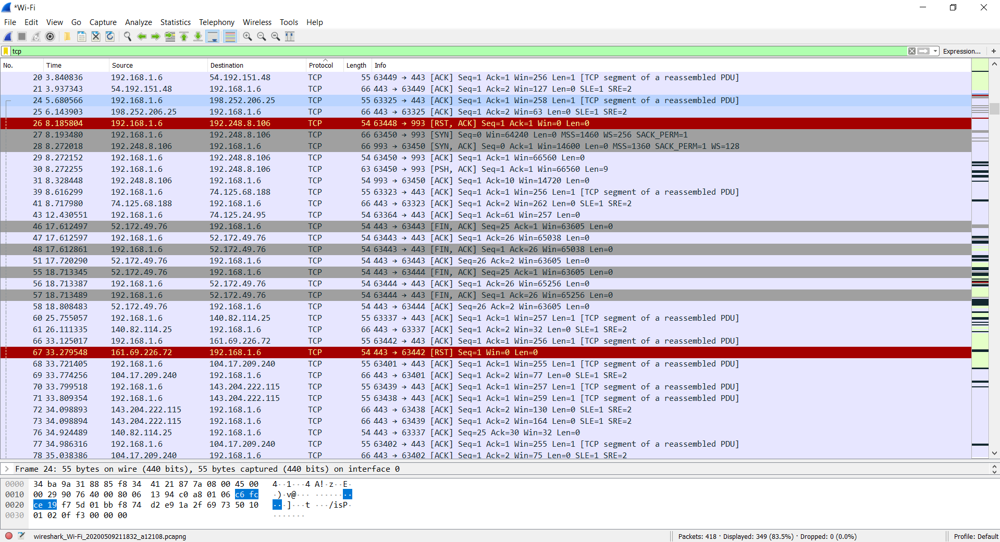
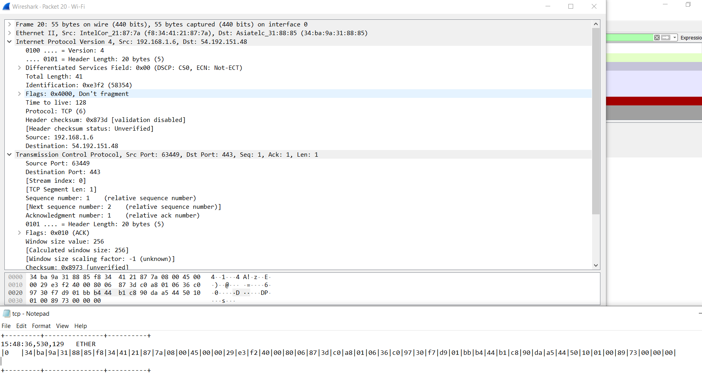
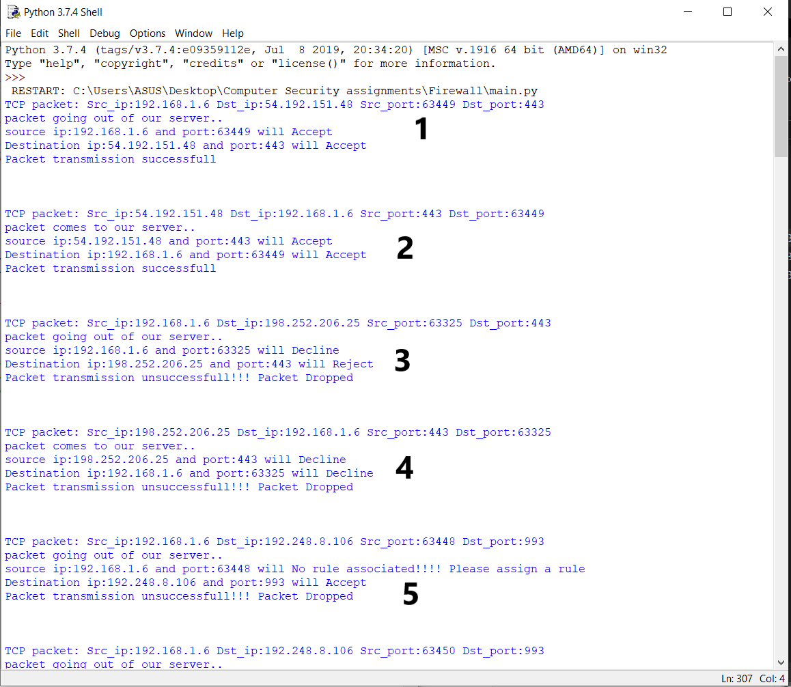

# 🔥 Firewall (Python) — Features, Tech Stack, How It Works, and Proofs


This project implements a simple, rules-driven software firewall in Python. It parses captured TCP/UDP packets, determines direction (inbound/outbound) via MAC address, and applies policy from INI configuration to accept, decline, or reject traffic.

## ✨ Features

### 🎯 Core Features
- **📦 Packet parsing**: Reads hex-formatted fields from captured packet logs ([packets/tcp.txt](packets/tcp.txt), [packets/udp.txt](packets/udp.txt)).
- **🔍 Protocol detection**: Uses the 23rd byte to identify TCP (`06`) vs UDP (`11`).
- **🌐 Direction detection**: Compares packet MAC to local MAC to classify packets as outbound or inbound.
- **⚙️ Rule engine**: INI-based policies for `Accept`, `Decline`, `Reject` per IP and port for inbound and outbound traffic.
- **📊 Verbose tracing**: Prints per-packet decisions for source/destination endpoints and overall transmission success/failure.

### 🚀 Enhanced Features (New!)
- **📝 Comprehensive Logging**: Separate log files for accepted/rejected/declined packets with timestamped entries.
- **📊 Statistics Dashboard**: Real-time tracking of packet counts, suspicious IPs, protocol distribution with JSON/CSV export.
- **🎯 Enhanced Rule Matching**: 
  - Port ranges (e.g., `80-8080`)
  - Wildcard IPs (e.g., `192.168.1.*`)
  - CIDR notation (e.g., `192.168.1.0/24`)
- **🚨 Alert System**: Configurable alerts via console, email, or webhooks for suspicious activity.
- **🔄 Dynamic Rule Reloading**: Automatically detects and reloads modified rule files without restart.
- **💻 CLI Interface**: Command-line options to toggle features and select packet files.

## 🛠️ Tech Stack

- **🐍 Language**: Python 3.8+ (tested on Windows)
- **📚 Core Libraries**: Python Standard Library
  - `configparser` - INI file parsing
  - `ipaddress` - CIDR and IP network handling
  - `logging` - File and console logging
  - `argparse` - CLI argument parsing
  - `json`, `csv` - Statistics export
  - `smtplib`, `email` - Email alerts
- **📦 Optional Dependencies**:
  - `requests` - Webhook alerts (install via `pip install -r requirements.txt`)
- **💾 Data**: Packet captures saved to text files in `packets/` (prepared with Wireshark)

## 📁 Project Structure

```
main.py                 # Entrypoint with CLI argument parsing
src/
  core.py               # Main processing loop with feature integration
  rule_engine.py        # Enhanced rule matching (wildcards, CIDR, ranges)
  logger.py             # Logging system for file outputs
  statistics.py         # Statistics tracking and export
  alerts.py             # Alert system (console, email, webhook)
  util.py               # Helpers: hex→IP, hex→port, MAC comparison
  tcp_packet.py         # TCP packet model
  udp_packet.py         # UDP packet model
  inbound rules.ini     # Inbound policy configuration
  outbound rules.ini    # Outbound policy configuration
  alert_config.json     # Alert system configuration
packets/
  tcp.txt               # Sample TCP capture (hex-separated fields)
  udp.txt               # Sample UDP capture
images/                 # Screenshots and diagrams
logs/                   # Generated log files (created at runtime)
stats/                  # Generated statistics files (created at runtime)
requirements.txt        # Python dependencies
README.md               # This document
setup.py                # Packaging scaffold
```

## ⚡ How It Works

1. Capture traffic with Wireshark and export key fields to text (see `packets/`).
2. Parse lines into an array of hex bytes in `src/core.py`:
	- Byte 23 → protocol (`06` = TCP, `11` = UDP).
	- Bytes 26–29 → source IP; 30–33 → destination IP.
	- Bytes 34–35 → source port; 36–37 → destination port.
3. Determine direction with `src/util.py:isSrc()` by comparing the packet MAC with the local MAC:
	- Match → packet is outbound (apply `outbound rules.ini`).
	- No match → packet is inbound (apply `inbound rules.ini`).
4. Evaluate policy in `src/rule_engine.py`:
	- Looks up IP in `Accepting ip`, `Declining ip`, `Rejecting ip` sections.
	- Ports are comma-separated per IP. Returns one of `Accept | Decline | Reject | No rule associated`.
5. A transmission succeeds only if both source and destination endpoints return `Accept` under the applicable direction.

## 🚀 Setup (Windows)

### Requirements

- Python 3.8+ installed and available in PATH
- PowerShell (default on Windows)

### Installation

1. Clone or download the repository:
```powershell
cd d:\project\Firewall
```

2. (Optional) Create a virtual environment:
```powershell
python -m venv .venv
.\.venv\Scripts\Activate.ps1
```

3. Install optional dependencies (for webhook alerts):
```powershell
pip install -r requirements.txt
```

## ▶️ Run the Firewall

### Basic Usage

```powershell
cd d:\project\Firewall
python main.py                    # Run with TCP packets (default)
```

### Advanced Options

```powershell
python main.py --udp              # Process UDP packets
python main.py --file packets/custom.txt  # Use custom packet file
python main.py --no-logging       # Disable file logging
python main.py --no-stats         # Disable statistics
python main.py --no-alerts        # Disable alert system
python main.py --help             # Show all options
```

### Output

The firewall generates:
- **Console output**: Real-time packet decisions
- **Log files** (in `logs/`): 
  - `firewall_TIMESTAMP.log` - All events
  - `accepted_TIMESTAMP.log` - Accepted packets only
  - `rejected_TIMESTAMP.log` - Rejected packets only
  - `declined_TIMESTAMP.log` - Declined packets only
- **Statistics** (in `stats/`):
  - `firewall_stats.json` - Detailed statistics
  - `firewall_stats.csv` - IP-based statistics
- **Alerts**: Console notifications for suspicious activity (10+ blocks)

### Notes

- If you see many "No rule associated" messages, add IP/port entries to the INI files.
- Press `Ctrl+C` to stop the firewall and view the final summary.

## ⚙️ Configuration

### Rule Files

- **Inbound policy**: [src/inbound rules.ini](src/inbound%20rules.ini)
- **Outbound policy**: [src/outbound rules.ini](src/outbound%20rules.ini)

#### Rule Sections

- `[Accepting ip]`: Allowed ports for each IP
- `[Declining ip]`: Explicitly declined ports for each IP
- `[Rejecting ip]`: Explicitly rejected ports for each IP

#### Enhanced Syntax

```ini
[Accepting ip]
# Exact IP with specific ports
192.168.1.6 = 63449,55173

# Port range (NEW!)
192.168.1.10 = 8000-9000

# Wildcard IP (NEW!)
192.168.1.* = 80,443

# CIDR notation (NEW!)
10.0.0.0/24 = 22,80,443

[Declining ip]
192.168.1.6 = 63325,57762

[Rejecting ip]
192.168.1.6 = 63439,59051,63450
```

### Alert Configuration

Edit [src/alert_config.json](src/alert_config.json) to configure alerts:

```json
{
  "enabled": true,
  "threshold": 10,
  "email": {
    "enabled": false,
    "smtp_server": "smtp.gmail.com",
    "smtp_port": 587,
    "from_email": "your-email@gmail.com",
    "to_email": "alert-recipient@gmail.com",
    "password": "your-app-password"
  },
  "webhook": {
    "enabled": false,
    "url": "https://hooks.slack.com/services/YOUR/WEBHOOK/URL"
  },
  "console_alerts": true
}
```

### Dynamic Reloading

Rule files are automatically reloaded when modified - no need to restart the firewall!

## ✅ Proofs

Screenshots (from `images/`):

- Protocol detection via byte 23: 
- Direction by MAC address: 
- Wireshark capture sample: 
- Capture text sample: 
- Flow overview: 

Sample console output (real run):

```
TCP packet: Src_ip:74.125.68.188 Dst_ip:192.168.1.6 Src_port:443 Dst_port:63323
packet comes to our server..
source ip:74.125.68.188 and port:443 will No rule associated!!!! Please assign a rule
Destination ip:192.168.1.6 and port:63323 will No rule associated!!!! Please assign a rule
Packet transmission unsuccessfull!!! Packet Dropped

TCP packet: Src_ip:192.168.1.6 Dst_ip:117.18.232.240 Src_port:63459 Dst_port:80
packet going out of our server..
source ip:192.168.1.6 and port:63459 will No rule associated!!!! Please assign a rule
Destination ip:117.18.232.240 and port:80 will No rule associated!!!! Please assign a rule
Packet transmission unsuccessfull!!! Packet Dropped
```

These outputs reflect the rule engine decisions given the current INI configuration. Adding the relevant IP/port entries under `Accepting ip` will change decisions to `Accept` and result in successful transmission messages.

## 🎨 Customization & Extensibility

- Update `inbound rules.ini` and `outbound rules.ini` to reflect your environment.
- Modify `src/core.py` to adjust parsing if your capture format differs.
- Extend `tcp_packet.py` / `udp_packet.py` with additional headers if needed.
- Configure `alert_config.json` to enable email or webhook notifications.
- Export statistics periodically for trend analysis.

## 📋 New Features Summary

| Feature | Description | File |
|---------|-------------|------|
| Logging | Timestamped logs with separate files for accepted/rejected/declined packets | [logger.py](src/logger.py) |
| Statistics | Track packet counts, IPs, ports with JSON/CSV export | [statistics.py](src/statistics.py) |
| Enhanced Rules | Port ranges, wildcards (`*`), CIDR notation (`/24`) | [rule_engine.py](src/rule_engine.py) |
| Alerts | Console/email/webhook notifications for suspicious IPs | [alerts.py](src/alerts.py) |
| Dynamic Reload | Auto-reload rule files when modified | [rule_engine.py](src/rule_engine.py) |
| CLI | Command-line options to toggle features | [main.py](main.py) |

## ⚠️ Known Limitations

- Packet text format must match the expected positions; malformed lines may cause parsing errors (e.g., `IndexError`). Trim or standardize your captures if needed.
- The demo currently reads `packets/tcp.txt` in `main.py`. UDP handling is implemented in `src` but not wired in the demo entry.
