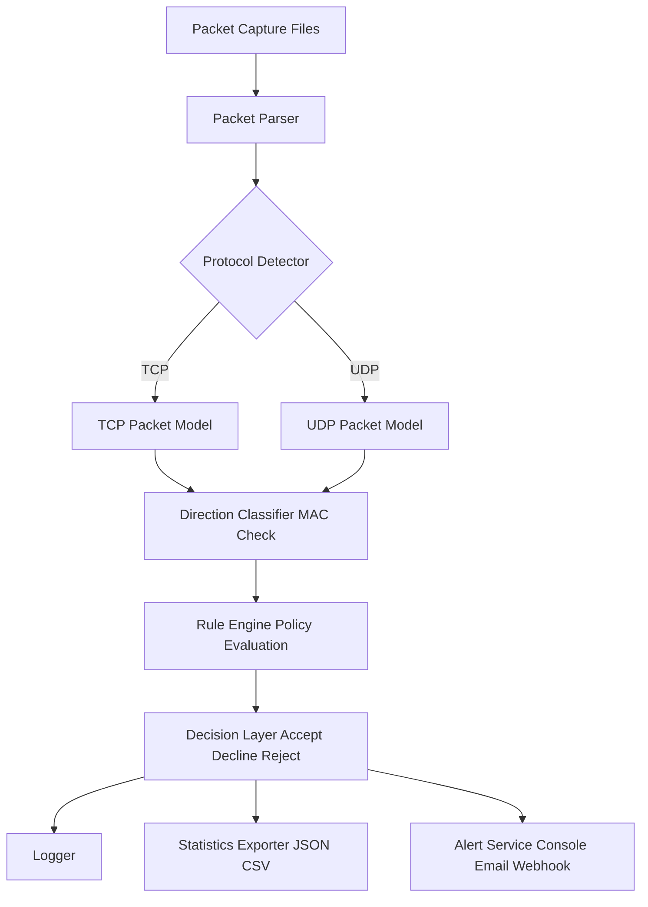

# Project Title

Firewall - Rule-Based Packet Filtering System

## Description / Overview

Firewall is a Python-based packet filtering project that simulates core firewall decision logic using configurable inbound and outbound policies. The system parses TCP and UDP packet capture data, classifies traffic direction, and evaluates each packet against rule definitions to determine whether it should be accepted, declined, or rejected.

This project is structured as a resume-ready security engineering implementation focused on modular design, traceability, and operational visibility.

## Features

- Processes TCP and UDP packet records from capture files
- Classifies inbound and outbound traffic using MAC-based direction checks
- Applies policy decisions using INI-driven rule sets
- Supports exact IP matching, wildcard patterns, CIDR blocks, and port ranges
- Produces packet decision outputs (Accept, Decline, Reject)
- Generates logging artifacts for traffic outcomes
- Tracks packet and IP statistics with JSON and CSV export support
- Supports alert channels through console, email, and webhook configuration

## Tech Stack

- Language: Python 3
- Core Modules: `argparse`, `configparser`, `ipaddress`, `logging`, `json`, `csv`, `smtplib`, `email`
- Optional Dependency: `requests` for webhook alerts
- Configuration Formats: INI (rule policies), JSON (alert configuration)
- Input Source: Packet capture text files

## Architecture / System Design

The solution follows a modular processing pipeline:

1. Packet input is read from capture files.
2. Protocol-specific fields are parsed into packet models.
3. Traffic direction is determined through MAC comparison.
4. Rule engine validates source and destination endpoints against policy files.
5. Decision layer returns packet outcome and routes side effects.
6. Observability components write logs, maintain statistics, and trigger alerts.

### Architecture Flowchart Diagram



The codebase is split by responsibility to keep packet parsing, rule evaluation, observability, and alerts independently maintainable.

## Installation & Setup

1. Clone the repository.

```powershell
git clone https://github.com/suvadityaroy/Firewall.git
cd Firewall
```

2. Navigate to the project folder if already cloned locally.

```powershell
cd d:\project\Firewall
```

3. Create and activate a virtual environment.

```powershell
python -m venv .venv
.\.venv\Scripts\Activate.ps1
```

4. Install dependencies.

```powershell
pip install -r requirements.txt
```

5. Run the application.

```powershell
python main.py
```

## Author / Contact

Author: Suvaditya Roy
Repository: https://github.com/suvadityaroy/Firewall.git
